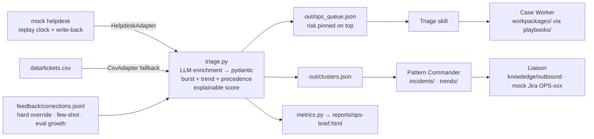

# Ops Control Tower — one ops owner + an AI execution layer

**Loop take-home · Sophie Huang**

**⏱ Try it in 2 seconds:** open **`reports/console-snapshot.html`** — a
zero-install snapshot of a real run (queue with every score explained,
incident/trend cards with closure states, the $118k wire work package, the
audit trail). No key, no clone, works offline. · 📹 Video: _[link goes here]_
· Weekly brief: `reports/ops-brief-2026-W33.html` · Full war room on your own
machine: `scripts/setup_demo.sh --dry-run` (checksum- & notarization-verified,
no sudo, offline by default)

Ops handles every ticket as an isolated unit, so the expensive problems — the
ones that live *across* tickets — go unseen. This tool reclaims them: it
triages the queue, detects cross-ticket patterns at two speeds, produces
internal work packages (not just replies), hands findings to the teams that
own the fixes, and **learns from staff corrections through a measured,
auditable feedback loop**.

## What the dataset actually contains (all numbers recomputed from the CSV)

| Segment | Volume | The tell |
|---|---|---|
| Verbatim-repeat FAQs | 53 tickets, 10 questions | median 5.6h, CSAT 3.7 — a help page answers them in 0 |
| Burst ①: online card declines, Aug 4–7 | 14 tickets, 12 customers, $70.8k MRR | 14 different subject lines; never declared as one incident |
| Burst ②: inbound USD wires, Aug 8–11 | 9 tickets, 8 customers | ≥$342k stated stuck funds; 5 of 9 still unresolved |
| Slow burn: FX pricing complaints, Jul 20–Aug 7 | 11 tickets, 10 customers, $58k MRR | one every ~2 days for 3 weeks; CSAT 1.67; invisible to any daily review |
| Risk hiding under polite subjects | 4 tickets | "Quick question" = unrecognized admin (possible ATO), still open |
| Long-tail grievances + routine | 9 tickets | worst individual experiences: avg 49.9h, CSAT 1.2 |

## Architecture



Team-sizing rule: **an agent exists only where LLM judgment is needed** —
classification is a function call, reporting is a script. Four skills over a
deterministic Python core; every hand-off is a file with a schema.

**UI: the OpenMausBot war room.** The four agents run as bots in
[OpenMausBot](https://github.com/milind-soni/OpenMausBot) 0.1.24 (MIT; bots
are real `claude` CLI processes) — one group room, shared repo cwd, so all
four discover the same `.claude/skills/` with zero fork. Setup, signature
verification, and the war-room scene script: `docs/openmausbot-setup.md`.
The shell carries zero business logic — everything also runs in plain
Claude Code.

## Two detectors + a precedence rule

- **Burst**: same theme chained ≤72h apart, ≥3 tickets (FAQ records excluded —
  two FAQ themes bunch 3-in-72h in this dataset and must not become incidents).
- **Trend**: ≥5 customers over ≥14 days at avg CSAT ≤2.5 — catches what the
  burst window is structurally blind to.
- **Precedence**: a burst candidate whose theme already spans ≥14 days is
  absorbed by the trend (the FX tail bunches 3-in-72h twice; without this rule
  it misfires as a mini-incident).

**Live results** (deterministic replay, `--speed 3600`): INC-001 declared on
the **3rd** decline ticket (7h13m after first report — the real team took 3
days to not declare it); INC-002 on the 3rd wire ticket; TRD-001 the moment
the FX theme crossed the 14-day span; all 4 risk tickets pinned on arrival.

## Measured, not vibed

24-ticket hand-labeled golden set; eval runs the production enrichment path
with **hard overrides OFF, few-shot ON, leave-one-out** (a correction about a
ticket never enters its own prompt — otherwise "generalization" is reading the
answer key).

| field | baseline | after 2 staff corrections |
|---|---|---|
| segment | 75% | **96%** |
| ops_workflow | 88% | 83% ⚠ |
| severity | 83%→100%¹ | 100% |
| risk_flags | 96% | 96% |
| amount_usd | 100% | 100% |

¹ severity/risk went to ~100% during prompt iteration before corrections.
⚠ **The regression is the point**: one fraud_ato correction over-generalized
onto three adjacent tickets — the eval caught a coaching side effect that
vibes never would. Reports: `eval/baseline_report.md`,
`eval/after_corrections_report.md`. Declared boundary: eval covers
classification + clustering; draft quality is assessed by humans.

## Agents make mistakes → staff coach them

- **Channel 1 — corrections** (`feedback/corrections.jsonl`): hard override on
  the ticket + few-shot exemplar for the future + merged into the golden set
  at every eval run.
- **Channel 2 — coaching** (`.claude/skills/*/NOTES.md`): one imperative rule
  per lesson, cap 20, humans prune.
- **Coaching authority is role-gated.** The room holds humans from different
  teams, modeled in `team/roster.json` (demo personas, real mechanism): only
  ops roles carrying `correct_labels` can author corrections the pipeline
  accepts — anyone else's entries stay as audit trail but never reach
  overrides, few-shot, or the eval (enforced in code, tested). Liaison
  addresses every brief to a named roster owner (engineering / product /
  compliance) — a handoff without a named recipient dies in a folder.
- Guardrails: agents never edit their own SKILL.md or src/; every piece of
  coaching is plain text under git — attributable, reviewable, revertible.
- **Every ticket action is traceable.** `out/actions.jsonl` is the append-only
  audit trail: each work package, incident card, brief, tracker issue, and
  correction lands as one validated line (who/what/when/which tickets).
  `python -m src.action_log --history TKT-2072` answers "what has happened to
  this ticket?" in one command; agents check it before touching a ticket.
- **Two more human gates, both audited.** Customer-facing drafts stay DRAFT
  until someone holding `approve_drafts` logs a `draft_approved` action; and
  cross-team escalation moves only on the **incident manager's** go-ahead
  (the war-room operator, sophie, role `approve_escalations`) — bots address
  her by name when a pattern is declared, and Liaison waits for her word.
- **Agents are whistles, not judges.** When a playbook misfits a ticket, the
  agent files a `correction_suggested` entry naming the ops members who can
  co-sign — it never changes a label itself.

## Reproduce (two paths)

**Path A — no API key (deterministic core, 71 tests):**
```bash
python3 -m venv .venv && .venv/bin/pip install -r requirements.txt fastapi httpx uvicorn
.venv/bin/python -m pytest          # 71 passed
open reports/ops-brief-2026-W33.html
```

**Path B — full pipeline (needs `OPENAI_API_KEY` in `.env`):**
```bash
.venv/bin/python -m src.triage --all        # enrich 100 tickets → queue + clusters
.venv/bin/python -m eval.run_eval           # accuracy table
.venv/bin/python -m src.metrics             # regenerate the HTML brief
# live demo:
.venv/bin/python -m src.mock_helpdesk --cursor 2026-08-03T00:00 --speed 3600 &
.venv/bin/python -m src.triage --watch --from 2026-08-03T00:00
```

## Repo tour

`src/` pipeline (enrichment, two detectors, scoring, theme canonicalization,
watch mode, mock helpdesk + adapters) · `tests/` 71 tests, memberships
hand-verified against the CSV (`tests/README.md` is the case inventory) ·
`.claude/skills/` the four agents · `team/roster.json` the humans across teams,
their coaching roles, and the incident-manager identity · `playbooks/` wire
investigation (shipped) + 2 stubs · `scripts/` war-room tooling
(`seed_openmausbot.py` seeds bots+room via the app's local API ·
`intro_bots.py` generates every member's role/duties/collaboration landing page ·
`reset_demo.sh` tiered state reset that never touches the enrichment cache or
corrections) · `incidents/ trends/ workpackages/ knowledge/` the agents'
actual output on this dataset — including the eng bug report filed as
**OPS-101** with a correlation hypothesis against (clearly SIMULATED) release
notes.

## Key assumptions & honest edges

Ticket text is the only system of record; MRR proxies customer impact; the
dataset is synthetic so the OpenAI API raises no privacy concern; helpdesk and
Jira are mocks behind real two-method seams (`HelpdeskAdapter`, `TrackerAdapter`)
— swapping in Zendesk/Intercom/Jira is the unglamorous part (OAuth, webhooks,
idempotent write-backs). Known edge, left honestly: the classifier misses
TKT-2070 as the 14th decline ticket (its text never says "card") — INC-001's
card flags it as a probable member for human confirmation.
