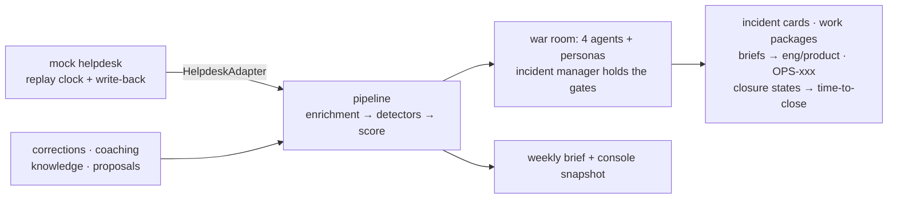

# Ops Control Tower

**Ops doesn't need a faster version of the old way of working — it needs an
AI-native one.** One human loop owner + four agents over a deterministic
pipeline: detect cross-ticket patterns, investigate, hand findings to the
teams that own the fixes, and track every pattern to confirmed closure.
Real agent leverage is structural, not conversational.

*Loop take-home · Sophie Huang · full write-up: [SUBMISSION.md](SUBMISSION.md)*

## Try it

| effort | path |
|---|---|
| **2 seconds** | open **[`reports/console-snapshot.html`](reports/console-snapshot.html)** — zero-install snapshot of a real run: the queue with every score explained, incident/trend cards with closure states, the $118k wire work package, the audit trail |
| 3 minutes | 📹 video: _[link goes here]_ · weekly brief: `reports/ops-brief-2026-W33.html` |
| 30 minutes | `scripts/setup_demo.sh --dry-run` — recreates the live war room from the official signed OpenMausBot release (checksum- & notarization-verified, no sudo, offline by default without an API key) |

## The five questions, in one breath each

1. **Problem** — the dataset shows ops running one-ticket-at-a-time: a 4-day
   card outage as 14 "separate" tickets, ≥$342k of wires stuck across 9 more,
   a three-week churn trend and an ATO signal that never reached their owners.
2. **Why** — a working sample of the *transposed organization*: the ops
   generalist becomes a loop owner (decisions, not artifacts) while agents
   execute; ops is the best starting point because every ticket is a natural
   training signal.
3. **How** — a shared team of agents (Triage / Pattern Commander / Case
   Worker / Liaison) in one war room over one pipeline (enrichment → burst +
   trend detectors → explainable score), with human gates on escalation,
   customer drafts and skill changes, and a closure state machine reporting
   **time-to-close beside time-to-declare**.
4. **Assumptions** — a team design: 4 agent roles + 3 human roles (loop
   owner / platform specialist / loop manager), compressed into one operator
   in this demo; the roster's role gates are the seams where they split.
5. **With more time** — live dashboard, eval-driven skill optimization,
   human-gated outbound replies, production helpdesk adapter.

Full versions with the numbers: [SUBMISSION.md](SUBMISSION.md).

## Architecture



## Measured, not vibed

| metric | result |
|---|---|
| Detection (full dataset) | wires **9/9** · FX trend **11/11** · declines **14/14**, zero false positives |
| Eval, segment accuracy | **75% → 96%** after two staff corrections (leave-one-out, overrides off) |
| Same eval run | caught a coaching side effect (ops_workflow 88% → 83%) — the harness works both ways |
| Live replay | INC-001 declared on the **3rd** ticket, 7h13m after first report (the real team took 3 days) |
| Tests | **71 green** (`tests/README.md` is the case inventory) |

## Reproduce

```bash
# Path A — no API key: deterministic core + committed artifacts
python3 -m venv .venv && .venv/bin/pip install -r requirements.txt fastapi httpx uvicorn
.venv/bin/python -m pytest                       # 71 passed
open reports/console-snapshot.html

# Path B — full pipeline (OPENAI_API_KEY in .env)
.venv/bin/python -m src.triage --all             # 100 tickets → queue + clusters
.venv/bin/python -m eval.run_eval                # accuracy table
.venv/bin/python -m src.mock_helpdesk &          # live demo
.venv/bin/python -m src.triage --watch --from 2026-08-03T00:00
```

## Repo tour

`src/` pipeline + detectors + audit trail + closure states + mock helpdesk ·
`tests/` 71 tests · `.claude/skills/` the four agents (SKILL.md fixed,
NOTES.md human-coached, KNOWLEDGE.md self-learned & agent-committed) ·
`team/roster.json` human roles and gates · `playbooks/` `knowledge/`
`incidents/` `trends/` `workpackages/` the agents' actual output — including
OPS-101 filed against (clearly SIMULATED) release notes · `scripts/` seed /
intros / reset / console export / verified setup · `docs/` demo script +
war-room setup. The repo is a git repository: human coaching, agent
self-learning and skill decisions share one audit timeline.
